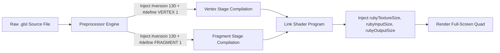

# Complete Guide to DirectDraw Wrapping: Hooking, OpenGL 3.3+ Streaming, CRT Shaders & Binary Safety

This guide provides an in-depth architectural breakdown and engineering tutorial on building a high-performance DirectDraw (`ddraw.dll`) wrapper for classic Windows 95/98/2000 games (such as *Diablo*, *StarCraft*, *Fallout*), rendering via modern OpenGL with post-processing CRT shaders, scaled mouse tracking, and low-level binary precautions.

---

## 1. DirectDraw Interception & Software Hooking Architecture

Legacy DirectX titles interact with the display hardware through exported Win32 entry points in `ddraw.dll` (`DirectDrawCreate`, `DirectDrawCreateEx`, `DirectDrawEnumerateA/W`). When a custom `ddraw.dll` is placed in the game executable's working directory, Windows DLL search order prioritizes the local file over `C:\Windows\System32\ddraw.dll`.

```
+-------------------------------------------------------------------------+
|                           diablo.exe (Game)                             |
+-------------------------------------------------------------------------+
       |                                              |
       | 1. Direct API Calls                          | 2. Intercepted IAT
       v                                              v
+-----------------------------+        +----------------------------------+
|      Exported Entry         |        |         MouseHook / IAT          |
|    DirectDrawCreate[Ex]     |        | - SetCursorPos / GetCursorPos    |
+-----------------------------+        | - GetClientRect / GetWindowRect  |
       |                               | - GetRegionData (Safe Fallback)  |
       v                               +----------------------------------+
+-----------------------------+                       |
|       DDrawImpl (COM)       |                       v
| - Mode: 640x480x8 (Paletted)|        +----------------------------------+
| - Creates DDrawSurfaceImpl  |        |    Storm.dll JMP Trampoline      |
+-----------------------------+        | - Safe_SBltROP3Tiled (10-args)   |
       |                               +----------------------------------+
       v                                              |
+-----------------------------+                       |
|      DDrawSurfaceImpl       |<----------------------+
| - System Memory Backbuffer  | (Lock / Blt / Unlock / Flip)
| - Palette Table (256 RGBA)  |
+-----------------------------+
       |
       | 3. Trigger Presentation (Flip / Unlock)
       v
+-------------------------------------------------------------------------+
|                  Renderer Pipeline (GLFW + OpenGL 3.3+)                 |
| - 8-Bit Index -> 32-Bit RGBA Texture Upload (glTexSubImage2D)           |
| - Aspect-Ratio Viewport Calculation (Letterbox / Pillarbox)             |
| - DOSBox SVN CRT GLSL Shader Pass (Vertex + Fragment Pipeline)          |
| - Present Framebuffer (SwapBuffers)                                     |
+-------------------------------------------------------------------------+
```

### 1.1 How Hooks Get Initialized

Hooks must be established as early as possible during process lifecycle:
1. **`DllMain` Process Attachment (`DLL_PROCESS_ATTACH`)**:
   - Disables Data Execution Prevention (DEP) policy via `SetProcessDEPPolicy(0)` so legacy JIT blitters in the game engine can run safely.
   - Invokes `MouseHook::init()` before any COM objects are created.
2. **Import Address Table (IAT) Traversal via Toolhelp32**:
   - Traverses all loaded modules in the process (`diablo.exe`, `Storm.dll`, `Diabloui.dll`) using `CreateToolhelp32Snapshot(TH32CS_SNAPMODULE | TH32CS_SNAPMODULE32)`.
   - Locates the Portable Executable (PE) `IMAGE_IMPORT_DESCRIPTOR` directory.
   - Scans for target imports (`user32.dll`, `gdi32.dll`, `kernel32.dll`, `storm.dll`).
   - Unprotects the IAT entry with `VirtualProtect(PAGE_EXECUTE_READWRITE)`, replaces the function pointer, and restores the original memory protection.
3. **Dynamic `LoadLibrary` Interception**:
   - Hooks `LoadLibraryA`, `LoadLibraryW`, `LoadLibraryExA`, and `LoadLibraryExW`.
   - When the game dynamically loads UI or network plugins (e.g. `Diabloui.dll`), the hook automatically intercepts the newly loaded module's IAT immediately.
4. **Inline 5-Byte JMP Trampolines**:
   - For internal non-IAT calls within third-party engine DLLs (e.g. internal calls to `Storm.dll!SBltROP3Tiled`), writes a 5-byte relative jump `E9 <relative_offset>` directly over the target function's prologue:
   $$\text{Relative Offset} = \text{Destination Address} - (\text{Source Address} + 5)$$

---

## 2. DirectDraw Surface Memory to OpenGL Texture Conversion

Classic 90s games predominantly use **8-bit paletted** (indexed color) or **16-bit RGB565** display modes. Modern GPUs and OpenGL 3.3+ core pipelines do not have hardware palette lookup tables. The wrapper bridges this gap through a high-throughput CPU-to-GPU texture streaming pipeline.

```
DirectDraw 8-Bit Index Buffer (640x480 Bytes)
[ 0x12 ][ 0x4F ][ 0x12 ][ 0x00 ] ...
    |       |       |       |
    |-------+-------+-------+----> Palette Table Lookup (256 x uint32_t RGBA)
                                   RGBA = Palette[Index] | 0xFF000000;
                                            |
                                            v
                               RGBA32 Streaming Buffer (640x480x4 Bytes)
                               [ R, G, B, A ][ R, G, B, A ] ...
                                            |
                                            v  glTexSubImage2D(GL_TEXTURE_2D, ...)
                               OpenGL 2D Texture (GL_RGBA8 Internal Format)
```

### 2.1 The Pixel Unpacking Routine

When a DirectDraw palette update occurs (`IDirectDrawPalette::SetEntries`), the wrapper updates an internal lookup table of 256 DWORD entries:
$$\text{LUT}[i] = \text{RGBA}(peRed, peGreen, peBlue, 255)$$

When the game calls `Flip()` or unlocks the primary surface, `Renderer::update_texture()` unpacks the entire $640 \times 480$ frame in a single linear cache-friendly pass:

```cpp
void Renderer::update_texture(const uint8_t* src_indices, int pitch) {
    uint32_t* dst_pixels = m_rgba_staging_buffer.data();
    const uint32_t* lut = m_palette_lut.data();

    for (int y = 0; y < game_height; ++y) {
        const uint8_t* row = src_indices + (y * pitch);
        uint32_t* out_row = dst_pixels + (y * game_width);
        
        for (int x = 0; x < game_width; ++x) {
            out_row[x] = lut[row[x]];
        }
    }

    glBindTexture(GL_TEXTURE_2D, texture_id);
    glTexSubImage2D(GL_TEXTURE_2D, 0, 0, 0, game_width, game_height,
                    GL_RGBA, GL_UNSIGNED_BYTE, dst_pixels);
}
```

### 2.2 Aspect-Ratio Maintained Viewport Calculation

To prevent widescreen stretching distortion on modern $16:9$ or $16:10$ monitors, the renderer calculates letterbox (horizontal black bars) or pillarbox (vertical black bars) margins:

$$\text{Scale} = \min\left(\frac{\text{Window Width}}{\text{Game Width}}, \frac{\text{Window Height}}{\text{Game Height}}\right)$$
$$W_{\text{viewport}} = \lfloor\text{Game Width} \times \text{Scale}\rfloor, \quad H_{\text{viewport}} = \lfloor\text{Game Height} \times \text{Scale}\rfloor$$
$$X_{\text{viewport}} = \left\lfloor\frac{\text{Window Width} - W_{\text{viewport}}}{2}\right\rfloor, \quad Y_{\text{viewport}} = \left\lfloor\frac{\text{Window Height} - H_{\text{viewport}}}{2}\right\rfloor$$

OpenGL renders the game quad strictly into `glViewport(X_viewport, Y_viewport, W_viewport, H_viewport)` while `glClearColor(0, 0, 0, 1)` fills the surrounding letterbox borders.

---

## 3. DOSBox SVN CRT GLSL Shader Pipeline

The wrapper supports standard DOSBox SVN single-file CRT shaders (`.glsl`), which combine vertex and fragment stages in a unified source guarded by preprocessor macros.

### 3.1 Preprocessing and Version Promotion

Older shaders written for OpenGL 2.x often specify `#version 120` and use deprecated keywords (`varying`, `attribute`, `texture2D`). The shader loader automatically promotes these shaders:
1. Strips existing `#version` directives.
2. Injects `#version 130` (or `#version 330 core`) at the top of both compilation units.
3. Defines stage macros: `#define VERTEX 1` for the vertex shader compilation, and `#define FRAGMENT 1` for the fragment shader compilation.
4. Maps modern keywords (`in`, `out`, `texture()`) while maintaining aliases for backwards compatibility.

### 3.2 Dynamic Uniform Injection

On every frame, `Shader::set_uniforms()` passes texture coordinate and resolution parameters:
- `rubyTextureSize`: Backing texture dimensions (e.g. `vec2(640.0, 480.0)`).
- `rubyInputSize`: Source resolution of the active frame (e.g. `vec2(640.0, 480.0)`).
- `rubyOutputSize`: Target physical viewport dimensions (e.g. `vec2(1440.0, 1080.0)`).
- `rubyTexture`: Bound sampler unit (`GL_TEXTURE0`).



---

## 4. Mouse Input Tracking & Coordinate Translation

When running classic games in a scaled or letterboxed window, mouse coordinates diverge into two separate reference frames:
1. **Screen/Client Window Space**: Physical pixels reported by Windows OS ($1920 \times 1080$).
2. **Game Logic Space**: Native $640 \times 480$ virtual coordinate space expected by game logic.

### 4.1 DirectInput Relative Delta Scaling

For games using DirectInput (`IDirectInputDeviceA::GetDeviceState` / `GetDeviceData`), mouse displacement is queried as relative ticks ($\Delta x, \Delta y$). If the window is enlarged by $2\times$, moving the mouse across the screen moves physical cursor $2\times$ faster.

The wrapper scales displacement deltas proportionally to viewport scaling:
$$\Delta x_{\text{scaled}} = \Delta x \times \frac{\text{Game Width}}{W_{\text{viewport}}}$$
$$\Delta y_{\text{scaled}} = \Delta y \times \frac{\text{Game Height}}{H_{\text{viewport}}}$$

### 4.2 Win32 Cursor Position Hooks

1. **`SetCursorPos(x, y)` Hook**:
   When the game moves the cursor programmatically (e.g., locking to the center of an inventory slot when grabbing an item):
   - Projects virtual game coordinates $(x_{\text{game}}, y_{\text{game}})$ into the active viewport.
   - Computes physical monitor coordinates via `MapWindowPoints(target_hwnd, NULL, &pt, 1)` and invokes real `SetCursorPos`.
2. **`GetCursorPos(&pt)` Hook**:
   When the game queries cursor position:
   - Converts monitor coordinates to client window coordinates.
   - Inverts viewport offset and scaling to return virtual $[0, 639] \times [0, 479]$ coordinates.
3. **Window Subclassing (`WrapperWndProc`)**:
   Intercepts `WM_MOUSEMOVE` and mouse button messages (`WM_LBUTTONDOWN/UP`, `WM_RBUTTONDOWN/UP`), translating `lParam` into game coordinates before passing to the game window procedure.

> [!WARNING]
> **Do not hook `ScreenToClient` or `ClientToScreen` for dialog layout calculations!**
> Windows dialogs and UI engines (like `Diabloui.dll`) use `ScreenToClient` and `ClientToScreen` internally to position child controls, buttons, and static background artwork relative to dialog parents. Injecting viewport scaling or letterbox offsets into these APIs displaces child controls across the screen. Keep `ScreenToClient` and `ClientToScreen` untouched.

---

## 5. Low-Level Binary Precautions for Safe Execution

Working with 1990s binary engines running under modern Windows WOW64 environments requires strict adherence to binary compatibility rules.

### 5.1 COM ABI Compatibility & Virtual Destructors

In MSVC (which compiled legacy DirectX titles), COM interface classes inherit from `IUnknown` and **do not have virtual destructors**. Object lifetime is managed exclusively by `IUnknown::Release()`.

```cpp
// CRITICAL ERROR in MinGW:
class DDrawPalette : public IDirectDrawPalette {
public:
    virtual ~DDrawPalette(); // GCC places destructor at vtable[0], shifting all methods by 4 bytes!
};

// CORRECT:
class DDrawPalette : public IDirectDrawPalette {
public:
    ~DDrawPalette(); // Non-virtual destructor preserves exact MSVC vtable offsets
    ULONG WINAPI Release() override {
        ULONG count = --m_ref;
        if (count == 0) delete this;
        return count;
    }
};
```

### 5.2 DEP (Data Execution Prevention) & JIT Engines

Blizzard's `Storm.dll` and other 90s graphics libraries generate dynamic x86 machine code into heap memory buffers (`0x15031058`) to execute custom ROP3 blitting loops. On Windows 10/11, hardware DEP terminates processes that execute code from heap pages.

**Precaution**: Call `SetProcessDEPPolicy(0)` in `DllMain` during `DLL_PROCESS_ATTACH` to disable strict DEP termination.

### 5.3 Exact `stdcall` Prototype Matching & Stack Balance

When hooking functions via inline trampolines, the hook replacement must match the **exact argument count and calling convention**:
- `Storm.dll!SBltROP3Tiled` takes **10 arguments** (`ret 0x28` / 40 bytes).
- Defining an 8-argument replacement pops only 32 bytes on return, corrupting `esp` by 8 bytes and causing immediate crashes upon returning to the caller.

```cpp
// CORRECT 10-argument stdcall prototype for Storm.dll!SBltROP3Tiled:
BOOL WINAPI Safe_SBltROP3Tiled(void* lpDest, RECT* lpDestRect, int destPitch,
                              void* lpSrc, RECT* lpSrcRect, int srcPitch,
                              int maskX, int maskY, void* lpMask, DWORD dwRop);
```

### 5.4 Elimination of Obsolete `IsBadReadPtr` / `IsBadWritePtr`

Microsoft documentation explicitly marks `IsBadReadPtr` and `IsBadWritePtr` as obsolete. On modern Windows:
- `IsBad*` triggers first-chance memory access violations (`STATUS_ACCESS_VIOLATION`) internally to catch faults via Structured Exception Handling (SEH).
- Calling `IsBad*` inside per-pixel inner loops severely degrades performance and trips debuggers / exception handlers.

**Precaution**: Replace `IsBad*` with mathematical coordinate clamping ($[0, 639] \times [0, 479]$) and non-faulting memory checks using `VirtualQuery`:

```cpp
static inline bool IsValidMemory(const void* ptr, size_t size) {
    if (!ptr) return false;
    MEMORY_BASIC_INFORMATION mbi;
    if (VirtualQuery(ptr, &mbi, sizeof(mbi)) == sizeof(mbi)) {
        return (mbi.State == MEM_COMMIT && !(mbi.Protect & PAGE_NOACCESS) && !(mbi.Protect & PAGE_GUARD));
    }
    return false;
}
```

### 5.5 Robust Region Data Fallbacks

Legacy UI dialogs often allocate dynamic memory based on the return value of `GetRegionData(hrgn, 0, NULL)`. When Windows GDI returns `0` for an uninitialized or empty region handle, engines that allocate 0 bytes (`SMemAlloc(0)`) leave the buffer uninitialized, reading uninitialized heap memory as `rdh.nCount`.

**Precaution**: Hook `GetRegionData` to evaluate valid bounding boxes via `GetRgnBox` and explicitly zero `lpRgnData->rdh` (`nCount = 0`) whenever a region is empty or invalid.

---

## 6. Deep Dive: Dynamic Heap Execution & The Hybrid ROP3 Architecture

A common dilemma when wrapping legacy DirectX titles is how to handle 1990s dynamic heap execution and software ROP3 raster engines:
- Should we hook memory allocations and call `VirtualProtect(PAGE_EXECUTE_READWRITE)`?
- Should we rewrite all ROP3 blitting logic in modern C++?
- Should we implement a bytecode/pixel-stream interpreter?

Below is the rationale behind what works, what fails, and why the **Hybrid Architecture** is optimal.

```
[ Diabloui.dll / Game UI ]
        |
        +---> Calls SBltROP3 (Animations / Fire / Alpha Masks)
        |          |
        |          v  (Unhooked / Native Storm Engine + DEP Disabled)
        |     Executes Full 256-Opcode ROP3, Transparency & Bitwise Blits
        |
        +---> Calls SBltROP3Tiled (Dialog Backgrounds & Listbox Scrollbars)
                   |
                   v  (Intercepted via 5-byte JMP Trampoline)
              Safe_SBltROP3Tiled (Custom C++ Wrapper)
              1. Clamps destination coordinates strictly to [0, 639] x [0, 479]
              2. Computes tile stepping (chunk_sx, chunk_sy, chunkW, chunkH)
              3. Delegates each bounded tile chunk back to native SBltROP3!
```

### 6.1 Handling Dynamic Heap Execution & DEP
**Approach**: `SetProcessDEPPolicy(0)` in `DllMain`

- **Why Not `VirtualProtect` on Allocations?**
  Blizzard’s `Storm.dll` manages its own internal sub-allocators and fixed heap buffers (e.g. `0x15031058`) for dynamic JIT generation. Hooking `SMemAlloc` / `HeapAlloc` to mark pages `PAGE_EXECUTE_READWRITE` adds per-allocation overhead and risks missing internal or static data buffers.
- **The Solution**:
  During `DLL_PROCESS_ATTACH` in `DllMain`, we dynamically locate `SetProcessDEPPolicy` in `kernel32.dll` and invoke `SetProcessDEPPolicy(0)` (`PROCESS_DEP_DISABLE`). This disables strict hardware Data Execution Prevention for the process, allowing Storm’s legacy runtime x86 machine-code generator to execute safely on modern Windows 10/11 without access violations.

### 6.2 Pure C++ Rewrite vs. Native JIT: The Hybrid Architecture

We evaluated whether to statically rewrite the entire ROP3 engine in C++, and discovered why a **Hybrid Architecture** is superior:

#### Why a Full C++ Rewrite Broke Menu Graphics:
When we initially wrote a naive C++ replacement for `SBltROP3` using `memcpy`, it caused severe graphical corruption on the title screen and menu backgrounds. In *Diablo (1997)*, `SBltROP3` does not just do plain blits:
- It processes arbitrary ROP3 raster operations (`dwRop` like `SRCCOPY`, `SRCAND`, `SRCPAINT`, `SRCINVERT`).
- It applies bitwise transparency masks (`lpMask`) to blend fire, smoke, and stone artwork into the paletted backbuffer.
- Blindly copying pixels with `memcpy` overwrote transparent pixels with opaque zeros.

#### The Winning Hybrid Solution:
1. **`SBltROP3` Remains Native**: Runs Storm's original JIT engine with DEP disabled, retaining 100% fidelity for all 256 ROP3 codes and transparency masks.
2. **`SBltROP3Tiled` is Hooked**: `Diabloui.dll`'s listbox scrollbars were passing out-of-bounds rectangle heights into `SBltROP3Tiled`, causing the native JIT code to blit past the 307,200-byte ($640 \times 480$) backbuffer surface (`mov %eax, (%edi)` past `0x555f000`).
3. **Safe Chunk Delegation**: `Safe_SBltROP3Tiled` clamps the destination bounds to $[0, 639] \times [0, 479]$, computes tile chunk boundaries, and **delegates each chunk back to native `SBltROP3`**. This prevents buffer overruns while preserving 100% native rendering quality.

---

## 7. Summary Checklist for Wrapper Development

| Feature | Key Requirement | Common Failure Mode |
|---|---|---|
| **COM ABI** | Non-virtual destructors in C++ classes | Methods shifted by +4 bytes; crashes on `SetEntries`/`SetPalette` |
| **DEP Policy** | `SetProcessDEPPolicy(0)` in `DllMain` | Instant `SIGSEGV` when running Storm JIT blitter |
| **Stack Balance** | Exact argument count in `stdcall` trampolines | `esp` misalignment corrupting caller stack frame |
| **GDI Regions** | Zero `rdh.nCount = 0` on empty/failed regions | Uninitialized heap garbage read as rectangle count |
| **Dialog Coordinates** | Never scale `ScreenToClient`/`ClientToScreen` | Static background art and buttons shifted across screen |
| **Texture Streaming** | Linear 8-bit $\to$ 32-bit LUT expansion | Palette corruption or heavy CPU rendering bottlenecks |
| **Shader Promotion** | Auto-promote `#version 120` to `#version 130` | OpenGL 3.3 Core Profile compile failure on legacy shaders |
